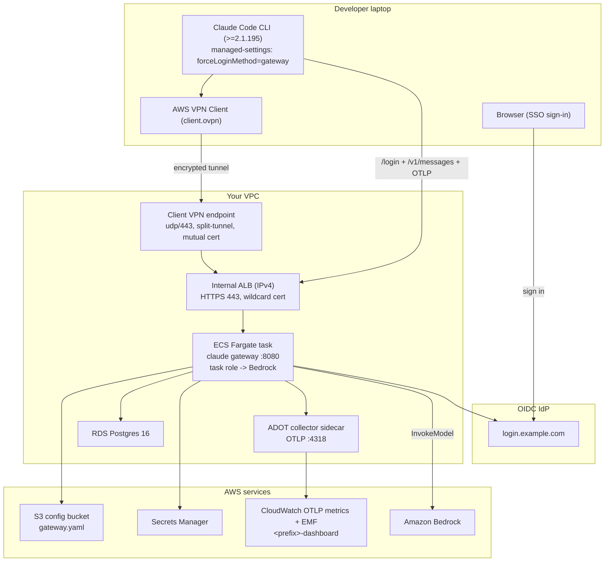

# Claude apps gateway on AWS

A worked, end-to-end deployment of Anthropic's [Claude apps gateway](https://code.claude.com/docs/en/claude-apps-gateway) on **ECS Fargate**, sitting in front of **Amazon Bedrock**, behind an **internal ALB**, with OIDC sign-in and per-user spend caps. Developer laptops reach it over **AWS Client VPN**, so no AWS credentials ever leave your account.

> **Why the shape.** Claude Code's CLI will only connect to a gateway whose hostname resolves to a **private IP** (RFC 1918, CGNAT, IPv6 ULA, or loopback). It's a deliberate security guard: a trusted gateway can push managed settings that run shell commands on the client, so there's no flag to loosen it. That's why the ALB is internal and laptops connect over VPN.

> **Proof of concept.** Sound defaults (private ALB, SSO with short-lived tokens, server-side model enforcement, Secrets Manager, encryption in transit and at rest, mutual-cert VPN). Before production: multi-AZ, cert/secret rotation, IAM least-privilege review, alerting, backups, and your change-management process.

**What you get:**
- ECS Fargate task running the `claude gateway` binary + an ADOT collector sidecar
- Internal ALB (HTTPS 443, wildcard cert), Route 53 alias to a private IP
- RDS Postgres 16 for gateway state
- Secrets Manager for JWT / DB / OIDC / admin write key
- S3-hosted `gateway.yaml` (versioned, TLS-only) — change config with no image rebuild
- CloudWatch dashboard for cost, tokens, per-user activity, Bedrock health
- Client VPN endpoint with mutual TLS, for laptop access

## Architecture



> **Cost.** Idle spend is ~**$115/month**: ~$72 Client VPN endpoint (per-hour, independent of traffic), ~$18 internal ALB, ~$15 RDS db.t4g.micro, plus small Fargate + CloudWatch charges. Tear down between demos to keep spend near $0. Production would also want NAT + Multi-AZ RDS on top.

## Prerequisites

- An existing **VPC** with **two subnets in different AZs** (used by the ALB, tasks, and RDS subnet group). This template does not create a VPC.
- **Route 53 private hosted zone** for the gateway hostname (`deploy.sh preflight` refuses public zones — see the escape hatch below if you can't avoid one).
- **ACM cert** covering the gateway hostname — see [Domain & cert](#domain--cert) for the three paths.
- **Amazon Bedrock model access** enabled for the Claude models in your region (a one-time console opt-in per model).
- **OIDC IdP** (Okta, Entra, Auth0, Google Workspace, Keycloak, etc.) — a confidential web app with a client secret. The issuer must serve `/.well-known/openid-configuration`.
- **Claude Code v2.1.195+** on the gateway image and every developer laptop.
- Local tooling: **aws CLI**, **curl**, **envsubst** (`brew install gettext` / `apt install gettext-base`), and **OpenSSL >= 1.1.1** (macOS's `/usr/bin/openssl` is LibreSSL and is rejected — `brew install openssl` and prepend to PATH).

## Domain & cert

`deploy.sh` doesn't create the domain, zone, or cert — you supply the ARN and zone id. You need one of these three arrangements:

| Path | Public domain? | Cost | Setup effort |
|---|---|---|---|
| **A. Public ACM cert on a domain you own** | Yes, for cert validation only | $0-$15/yr (registration) | Low |
| **B. ACM Private CA** | No | ~$400/mo per CA | Medium |
| **C. Self-signed cert imported to ACM** | No | $0 | High (distribute root CA via MDM) |

**Recommended: Path A.** The pattern:

1. Own or delegate any real domain (any registrar, any TLD — a $10/yr one works).
2. `aws acm request-certificate --domain-name '*.internal.mycompany.com' --validation-method DNS` and complete the DNS validation via your public zone.
3. Create a **private** Route 53 hosted zone for `internal.mycompany.com` and associate it with your VPC. This is where the gateway A-record lives, so no public DNS ever exposes the internal ALB's private IP.
4. Fill in `deploy.env` with the cert ARN + private zone id + `HOSTNAME_FQDN=claude-gateway.internal.mycompany.com`.

Path B skips public DNS entirely but requires a $400/mo Private CA. Path C is only realistic if your org already ships a corporate root CA via MDM.

## Deploy

```bash
bash deploy.sh init                  # interactive: discovers AWS-side inputs, prompts for the rest
bash deploy.sh                       # runs: preflight -> app -> [vpn] -> verify
```

`init` writes `deploy.env` for you (mode 0600, git-ignored). It lists your VPCs / subnets / ACM certs / R53 zones / ECR images and lets you pick from a numbered list; only the human-decision fields (NAME_PREFIX, HOSTNAME_FQDN, OIDC creds, EMAIL_DOMAIN, ADMIN_GROUP) require typing. Prefer to write `deploy.env` by hand? `cp deploy.env.example deploy.env` and edit.

`deploy.sh` reads config **only from `deploy.env`** — no personal defaults, no environment guessing. Every subcommand is idempotent:

| Subcommand | What it does |
|---|---|
| `bash deploy.sh init` | Interactive discovery + prompts, writes `deploy.env` |
| `bash deploy.sh preflight` | Read-only: creds, VPC, subnet AZ diversity, ACM cert region + SAN, private R53 zone, OIDC discovery URL, Bedrock reachability, ECR image, no stale Secrets Manager tombstones |
| `bash deploy.sh app` | Deploy the gateway stack, render `gateway.yaml.template` via envsubst, upload to S3, roll ECS. **Hard-fails** on rollout failure or non-COMPLETED state. |
| `bash deploy.sh vpn` | Delegate to `vpn-setup.sh` (Client VPN endpoint + `client.ovpn` profile) if `DEPLOY_VPN=yes` |
| `bash deploy.sh verify` | Check rollout state, probe `/healthz`, tail logs for OIDC discovery success |
| `bash deploy.sh` (no arg) | preflight + app + [vpn] + verify |

OIDC creds are `NoEcho` CFN parameters, populated into `<NAME_PREFIX>/oidc` on first CREATE — no `put-secret-value` step, no `REPLACE_ME` placeholder. Register the OIDC app in your IdP first (redirect URI `https://<gateway-host>/oauth/callback`) and paste the `client_id` + `client_secret` into `deploy.env`.

### Multiple stacks side-by-side

Every user-visible resource name is threaded through `NAME_PREFIX`. For a parallel test stack in the same account, change three lines in `deploy.env`:

```env
NAME_PREFIX=claude-gateway-test
GW_STACK=claude-apps-gateway-test
HOSTNAME_FQDN=claude-gateway-test.internal.example.com
```

`NAME_PREFIX` rules: 1-19 chars, lowercase alphanumeric + hyphens, no leading/trailing hyphen (keeps ALB / TG / DB name-length limits satisfied when suffixes append).

### Escape hatches

Preflight is strict. If a check fails on a POC and you know what you're doing:

- `PREFLIGHT_ALLOW_PUBLIC_ZONE=yes bash deploy.sh …` bypasses the private-Route-53 requirement (accepts the "internal-IP-in-public-DNS" finding).

Don't put bypasses in `deploy.env` — keep them per-invocation.

## Laptop side

Two things per laptop.

**1. Managed settings.** `forceLoginMethod` / `forceLoginGatewayUrl` are honored only from the managed tier (not `~/.claude/settings.json`). Write this JSON to the OS-specific path:

| OS | Path |
|---|---|
| macOS | `/Library/Application Support/ClaudeCode/managed-settings.json` |
| Linux | `/etc/claude-code/managed-settings.json` |
| Windows | `%ProgramData%\ClaudeCode\managed-settings.json` |

```json
{"forceLoginMethod":"gateway","forceLoginGatewayUrl":"https://<your-gateway-host>"}
```

Writing this file requires elevated permissions on every OS. In a managed fleet, ship it via MDM (Jamf, Intune) rather than expecting each developer to install by hand.

**2. Client VPN.** `bash vpn-setup.sh` mints the CA, server cert (imports to ACM), and client cert, then builds a `client.ovpn` with the private key inlined (mode 0600). Import into the **AWS VPN Client** and connect. Back up `ca.key` + `client.key` to a password manager — onboarding new users is a client-cert mint that never touches the endpoint. Losing the CA forces a full regen (endpoint replacement, minutes of downtime).

Then: `claude` → `/login` → complete SSO. A healthy sign-in produces these events in `/ecs/<NAME_PREFIX>`:

```json
{"evt":"device.verify","result":"redirect"}
{"evt":"session.mint","email":"developer@example.com","client_ip":"172.31.x.x","ttl_hours":8}
{"evt":"inference","path":"/v1/messages","model":"claude-opus-4-7","upstream":"bedrock","status":200,"ms":3681}
```

## Day-2 ops

**Change config (models, RBAC, spend caps, telemetry).** Edit `gateway.yaml.template`, then `bash deploy.sh app`. Takes ~2 min end-to-end. Model access and per-group policies are enforced server-side — a client can't request a model you haven't allowed.

Example: gate `WebFetch`/`WebSearch` and restrict contractors to Haiku:

```yaml
managed:
  policies:
    - match: { groups: [eng-contractors] }
      cli:
        availableModels: [claude-haiku-4-5]
        enforceAvailableModels: true
        permissions: { deny: ["WebFetch", "WebSearch"] }
    - match: {}                              # catch-all
      cli:
        availableModels: [claude-opus-4-8, claude-sonnet-5, claude-haiku-4-5]
```

**Spend caps.** Runtime state, no redeploy needed. `manage-spend-limits.sh` auto-fetches `ADMIN_KEY` from Secrets Manager when `deploy.env` is sourced:

```bash
bash manage-spend-limits.sh set-org 500                # $500/month org-wide
bash manage-spend-limits.sh set-group contractors 50 daily
bash manage-spend-limits.sh set-user <oidc_sub> 20 daily
bash manage-spend-limits.sh list                       # or `effective` to see per-caller
bash manage-spend-limits.sh delete spl_xxxx            # requires typed DELETE
```

Find a user's `oidc_sub` in the `user_id` field of `effective`.

**Teardown.** `bash teardown.sh` — typed `DELETE` confirmation (or `CONFIRM=DELETE bash teardown.sh` for CI). Order: VPN stack → force-delete secrets (kills the 30-day tombstone that would block a re-deploy) → empty the versioned config bucket in batches → delete the gateway stack. RDS leaves a final snapshot (`<prefix>-db-final-*`) because `DeletionPolicy: Snapshot` — delete manually to reclaim storage.

## Cost breakdown

| Item | Hourly | ~Monthly (idle) |
|---|---|---|
| Client VPN endpoint | $0.10 | $72 |
| Internal ALB | $0.025 | $18 |
| RDS db.t4g.micro | $0.021 | $15 |
| Fargate (0.5 vCPU, 2 GB) | $0.024 | $10 |
| CloudWatch (logs + metrics) | — | ~$5 |
| **Total idle** | | **~$120** |
| Bedrock inference | usage-based | on top |

VPN endpoint dominates. Disconnect the VPN client when idle if you want to skip the ~$0.05/hr per-connection charge on top.

## Troubleshooting

**"Couldn't load settings from Cloud gateway" — but the gateway is reachable.** This looks like a network error but is auth. With VPN up, `dig +short <gateway-host>` returns private IPs and `curl -sk https://<gateway-host>/healthz` prints `ok`; yet `claude` still fails. Check the gateway audit log — you'll see `auth.denied` with `reason: invalid_token`. The CLI is presenting a stale credential (prior gateway session or a personal API login in the macOS Keychain). Clear it:

```bash
claude auth logout
security delete-generic-password -s "Claude Code-credentials" 2>/dev/null || true
claude          # then /login inside the TUI
```

**ECS rollout stuck / task not healthy.** `aws logs tail /ecs/<NAME_PREFIX> --since 10m`. Common causes: OIDC discovery URL unreachable from the VPC (add a NAT / VPC endpoint or check the security group egress), config template referenced an env var you didn't add to the envsubst allowlist in `deploy.sh` (post-render check should have caught this — check the deploy output), or the image entry pointed at an ECR tag that no longer exists.

**Next deploy fails "already scheduled for deletion".** A prior teardown left one of the four `<NAME_PREFIX>/*` secrets in the 30-day recovery window. `deploy.sh preflight` catches this and tells you which secret; `aws secretsmanager restore-secret --secret-id <name>` fixes it.

**Stack CREATE completes but /login is broken.** `/healthz` doesn't depend on OIDC (discovery is lazy). Watch the log tail for OIDC discovery events, and confirm the redirect URI in your IdP exactly matches `https://<HOSTNAME_FQDN>/oauth/callback`.

## Why this shape

The common alternative is client-side STS federation: each laptop federates to STS and holds 12-hour AWS credentials. The gateway inverts that — the AWS credential lives only in the gateway, and clients hold only an SSO bearer token.

|  | Client-side STS federation | Claude apps gateway |
|---|---|---|
| AWS creds location | On each laptop (12h STS) | Only in the gateway |
| Model access enforcement | Client managed settings | Server-side (400 on denied model) |
| Spend caps | Custom (DynamoDB + Lambda + API GW) | Built-in per-user/group/org caps |
| Infra footprint | ~8 CloudFormation stacks | 1 container + Postgres |
| Maintained by | You | Anthropic (tested per release) |

## Limitations

- CLI requires a private-IP gateway — no public option.
- No server-side web search; 5-minute prompt cache only (no 1-hour TTL); no first-party-only optimizations.
- OIDC only, one issuer per gateway. No SAML or LDAP. No CI/service-token flow (browser device flow only).
- Linux server only.

## Repository layout

- `deploy.env.example` — copy to `deploy.env` and fill in.
- `deploy.sh` — orchestrator (`init | preflight | app | vpn | verify`).
- `phase2-fargate.yaml` — gateway CloudFormation stack.
- `client-vpn.yaml` — Client VPN stack (parallel-stack-safe via `NamePrefix` + `GatewayStackName`).
- `gateway.yaml.template` — gateway config; deploy-time values rendered by `envsubst`, runtime placeholders resolved by the gateway binary.
- `Dockerfile` + `entrypoint.sh` — non-root container, fetches config from S3, fails hard if the fetch fails.
- `buildspec-image.yml` — CodeBuild build for environments without local Docker.
- `vpn-setup.sh` — OpenSSL PKI + ACM import + `client.ovpn` builder.
- `manage-spend-limits.sh` — admin API wrapper for spend caps.
- `teardown.sh` — reversal, secrets-before-stack ordering, bounded waiter.
- `lib/init.sh` — interactive AWS discovery + prompts, generates `deploy.env`.
- `lib/preflight.sh` — read-only preflight checks (also runnable standalone).
