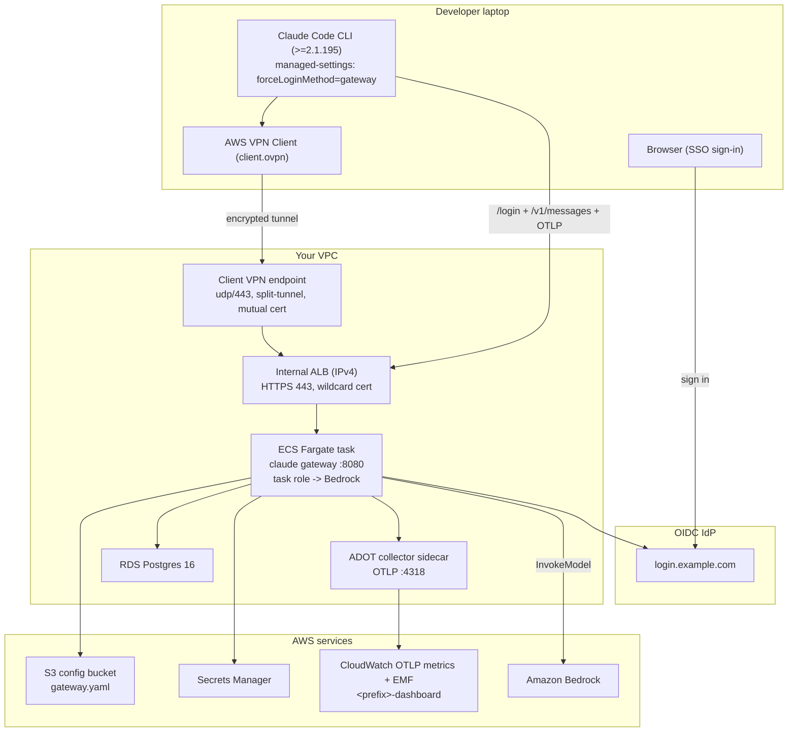

# Giving your team Claude Code on Bedrock, without spraying AWS keys across laptops

Say you want your developers using [Claude Code](https://code.claude.com), but backed by **Amazon Bedrock** in your own account instead of a consumer plan. You want SSO sign-in, per-user spend limits, and control over which models people can call. And you'd very much prefer that no long-lived AWS credentials ever land on a laptop.

This repo is a working, end-to-end answer to that. It deploys Anthropic's [Claude apps gateway](https://code.claude.com/docs/en/claude-apps-gateway) on **ECS Fargate**, in front of Bedrock, behind an **internal load balancer**, with OIDC login and spend caps. Developers reach it over **AWS Client VPN**. The AWS credential lives in one place (the gateway), and each laptop holds nothing but a short-lived SSO token.

Below is the whole story: the one constraint that shapes the design, how a request actually flows, what each piece is for, and how to stand it up, run it, and tear it down.

> **A quick honesty note.** This is a proof of concept with sound defaults (private ALB, short-lived SSO tokens, server-side model enforcement, Secrets Manager, encryption in transit and at rest, mutual-cert VPN). Before production you'll still want multi-AZ, cert and secret rotation, an IAM least-privilege pass, alerting, backups, and your usual change management.

## The one constraint that shapes everything

Here's the design decision that everything else follows from: **Claude Code's CLI will only talk to a gateway whose hostname resolves to a private IP** (RFC 1918 like `10.x`/`172.16.x`/`192.168.x`, carrier-grade NAT, IPv6 ULA, or loopback).

That's not an oversight you can flag your way around. A trusted gateway can push *managed settings* that run shell commands on the client, so Anthropic deliberately refuses to treat a public endpoint as trusted. There's no override.

Once you accept that, the rest of the shape is forced: the load balancer has to be **internal**, and laptops need a **private network path** to reach it. That path is the Client VPN. If the design looks heavier than "just put it behind HTTPS," this is why.

## What's in the box, and what each piece is for

- **ECS Fargate task** runs the `claude gateway` binary, the proxy that authenticates users and forwards their requests to Bedrock. Riding alongside it is an **ADOT collector** sidecar (AWS Distro for OpenTelemetry), which ships usage metrics to CloudWatch.
- **Internal ALB** is an HTTPS-only load balancer (443, wildcard cert) reachable *only* from inside your VPC. A Route 53 alias points the gateway hostname at its private IP.
- **RDS Postgres 16** keeps gateway state: sessions and spend counters.
- **Secrets Manager** holds the JWT signing key, database password, OIDC client secret, and admin API key. They're injected into the task at runtime, so nothing sensitive is baked into the container image.
- **S3-hosted `gateway.yaml`** is the live config (versioned, TLS-only). Change your models, access rules, or spend caps by editing and re-uploading. No image rebuild.
- **CloudWatch dashboard** shows per-user cost, token usage, activity, and Bedrock API health, fed by OTLP (OpenTelemetry) and EMF (Embedded Metric Format) data from the collector.
- **Client VPN endpoint** is a mutual-TLS VPN that gives laptops their private path to the internal ALB.

## How it fits together



Following a single request makes the diagram concrete. A developer connects the VPN, runs `claude`, and signs in. The CLI opens their browser to your identity provider for SSO; the gateway validates that OIDC login and mints a short-lived bearer token. From then on every `claude` request travels laptop → VPN → internal ALB → gateway. The gateway checks the token, applies your model and spend-cap policy, and only then calls Bedrock using the *gateway's* IAM role. The credential never leaves the gateway; the laptop only ever holds a temporary token.

> **What it costs.** Sitting idle, this runs about **$115/month**: roughly $72 for the Client VPN endpoint (billed per hour, regardless of traffic), $18 for the internal ALB, $15 for RDS `db.t4g.micro`, plus small Fargate and CloudWatch charges. Tear it down between demos to keep spend near zero. Production would add NAT and Multi-AZ RDS on top. There's a full breakdown near the end.

## Before you start

You'll need a few things already in place. This template deliberately doesn't create your network or your DNS, it plugs into them.

- An existing **VPC** with **two subnets in different AZs** (the ALB, tasks, and RDS subnet group use them).
- A **Route 53 private hosted zone** for the gateway hostname. `deploy.sh preflight` refuses public zones by default, because a public zone would leak your internal ALB's private IP to the world's DNS. There's an escape hatch if you truly can't avoid one.
- An **ACM certificate** covering the gateway hostname. The next section walks through the three ways to get one.
- **Amazon Bedrock model access** enabled for the Claude models in your region (a one-time console opt-in per model).
- An **OIDC identity provider** (Okta, Entra, Auth0, Google Workspace, Keycloak, and so on): a confidential web app with a client secret, whose issuer serves `/.well-known/openid-configuration`.
- **Claude Code v2.1.195+** on both the gateway image and every developer laptop.
- Local tools: **aws CLI**, **curl**, **envsubst** (`brew install gettext` / `apt install gettext-base`), and **OpenSSL >= 1.1.1**. Note that macOS ships LibreSSL at `/usr/bin/openssl`, which AWS rejects for cert import, so `brew install openssl` and put it ahead on your PATH.

## Sorting out a domain and cert

`deploy.sh` won't create your domain, zone, or cert; you hand it an ARN and a zone id. Three arrangements work, in ascending order of pain:

| Path | Public domain? | Cost | Setup effort |
|---|---|---|---|
| **A. Public ACM cert on a domain you own** | Yes, for cert validation only | $0-$15/yr (registration) | Low |
| **B. ACM Private CA** | No | ~$400/mo per CA | Medium |
| **C. Self-signed cert imported to ACM** | No | $0 | High (distribute root CA via MDM) |

**Path A is the one to reach for.** The trick is that a public cert doesn't force a public endpoint:

1. Own or delegate any real domain (any registrar, any TLD; a $10/yr one is fine).
2. Request the cert: `aws acm request-certificate --domain-name '*.internal.mycompany.com' --validation-method DNS`, and complete DNS validation in your public zone.
3. Create a **private** Route 53 hosted zone for `internal.mycompany.com` and associate it with your VPC. The gateway's A-record lives here, so public DNS never sees the internal ALB's private IP.
4. Put the cert ARN, the private zone id, and `HOSTNAME_FQDN=claude-gateway.internal.mycompany.com` into `deploy.env`.

Path B skips public DNS entirely but costs $400/mo for the Private CA. Path C only makes sense if your org already pushes a corporate root CA through MDM.

## Deploying it

Two commands get you there:

```bash
bash deploy.sh init                  # interactive: discovers AWS-side inputs, prompts for the rest
bash deploy.sh                       # runs: preflight -> app -> [vpn] -> verify
```

`init` writes `deploy.env` for you (mode 0600, git-ignored). It lists your VPCs, subnets, ACM certs, Route 53 zones, and ECR images and lets you pick from numbered menus; you only type the human-decision fields (`NAME_PREFIX`, `HOSTNAME_FQDN`, the OIDC creds, `EMAIL_DOMAIN`, `ADMIN_GROUP`). Prefer to write the file by hand? `cp deploy.env.example deploy.env` and edit.

From there, `deploy.sh` reads config **only from `deploy.env`**. No personal defaults, no guessing at your environment. Each subcommand is idempotent, so you can rerun any of them safely:

| Subcommand | What it does |
|---|---|
| `bash deploy.sh init` | Interactive discovery and prompts, writes `deploy.env` |
| `bash deploy.sh preflight` | Read-only checks: creds, VPC, subnet AZ diversity, ACM cert region and SAN, private R53 zone, OIDC discovery URL, Bedrock reachability, ECR image, and no stale Secrets Manager tombstones |
| `bash deploy.sh app` | Deploys the gateway stack, renders `gateway.yaml.template` via envsubst, uploads to S3, rolls ECS. **Hard-fails** on a bad rollout. |
| `bash deploy.sh vpn` | Delegates to `vpn-setup.sh` (Client VPN endpoint plus a `client.ovpn` profile) when `DEPLOY_VPN=yes` |
| `bash deploy.sh verify` | Checks rollout state, probes `/healthz`, tails logs for OIDC discovery success |
| `bash deploy.sh` (no arg) | preflight + app + [vpn] + verify |

The OIDC credentials go in as `NoEcho` CloudFormation parameters and land in the `<NAME_PREFIX>/oidc` secret on the first CREATE. There's no separate `put-secret-value` step and no `REPLACE_ME` placeholder to remember. Just register the OIDC app in your IdP first (redirect URI `https://<gateway-host>/oauth/callback`) and paste the `client_id` and `client_secret` into `deploy.env`.

### Running more than one stack

Every user-visible resource name is threaded through `NAME_PREFIX`, so a parallel test stack in the same account is three lines in `deploy.env`:

```env
NAME_PREFIX=claude-gateway-test
GW_STACK=claude-apps-gateway-test
HOSTNAME_FQDN=claude-gateway-test.internal.example.com
```

Keep `NAME_PREFIX` to 1-19 lowercase alphanumeric characters and hyphens, no leading or trailing hyphen. That keeps the ALB, target group, and DB names within length limits once suffixes are appended.

### When you need to bend a rule

Preflight is strict on purpose. If a check fails on a POC and you know what you're doing:

- `PREFLIGHT_ALLOW_PUBLIC_ZONE=yes bash deploy.sh …` waives the private-Route-53 requirement and accepts the "internal IP in public DNS" finding.

Keep bypasses per-invocation; don't bake them into `deploy.env`.

## Setting up a laptop

Two things per machine.

**First, managed settings.** `forceLoginMethod` and `forceLoginGatewayUrl` are honored only from the managed tier, not `~/.claude/settings.json`. Drop this JSON at the OS-specific path:

| OS | Path |
|---|---|
| macOS | `/Library/Application Support/ClaudeCode/managed-settings.json` |
| Linux | `/etc/claude-code/managed-settings.json` |
| Windows | `%ProgramData%\ClaudeCode\managed-settings.json` |

```json
{"forceLoginMethod":"gateway","forceLoginGatewayUrl":"https://<your-gateway-host>"}
```

Writing that file needs elevated permissions everywhere, so in a real fleet you'd ship it through MDM (Jamf, Intune) rather than asking each developer to place it by hand.

**Second, the VPN.** `bash vpn-setup.sh` mints the CA, the server cert (importing it to ACM), and a client cert, then assembles a `client.ovpn` with the private key inlined (mode 0600). Import that into the **AWS VPN Client** and connect. Back up `ca.key` and `client.key` to a password manager, because onboarding the next teammate is then just a client-cert mint that never touches the endpoint. Lose the CA and you're into a full regen, which replaces the endpoint and costs a few minutes of downtime.

With the VPN up, it's `claude` → `/login` → finish SSO in the browser. A healthy sign-in leaves this trail in `/ecs/<NAME_PREFIX>`:

```json
{"evt":"device.verify","result":"redirect"}
{"evt":"session.mint","email":"developer@example.com","client_ip":"172.31.x.x","ttl_hours":8}
{"evt":"inference","path":"/v1/messages","model":"claude-opus-4-7","upstream":"bedrock","status":200,"ms":3681}
```

## Living with it: day-2 operations

**Changing config** (models, access rules, spend caps, telemetry) is a two-minute loop: edit `gateway.yaml.template`, then `bash deploy.sh app`. Because model access and per-group policy are enforced *server-side*, a client can't sneak in a model you haven't allowed. Here's a policy that keeps contractors on Haiku and blocks web tools for them:

```yaml
managed:
  policies:
    - match: { groups: [eng-contractors] }
      cli:
        availableModels: [claude-haiku-4-5]
        enforceAvailableModels: true
        permissions: { deny: ["WebFetch", "WebSearch"] }
    - match: {}                              # catch-all
      cli:
        availableModels: [claude-opus-4-8, claude-sonnet-5, claude-haiku-4-5]
```

**Spend caps** are runtime state, so no redeploy is involved. `manage-spend-limits.sh` pulls the admin key from Secrets Manager automatically once `deploy.env` is sourced:

```bash
bash manage-spend-limits.sh set-org 500                # $500/month org-wide
bash manage-spend-limits.sh set-group contractors 50 daily
bash manage-spend-limits.sh set-user <oidc_sub> 20 daily
bash manage-spend-limits.sh list                       # or `effective` to see per-caller
bash manage-spend-limits.sh delete spl_xxxx            # requires typed DELETE
```

A user's `oidc_sub` shows up in the `user_id` field of `effective`.

**Tearing it down** is `bash teardown.sh`, which asks you to type `DELETE` (or set `CONFIRM=DELETE` for CI). It works in a deliberate order: delete the VPN stack, force-delete the secrets so the 30-day recovery tombstone can't block your next deploy, empty the versioned config bucket in batches, then delete the gateway stack. RDS leaves a final snapshot behind (`<prefix>-db-final-*`) because its `DeletionPolicy` is `Snapshot`, so delete that by hand when you want the storage back.

## The full cost picture

| Item | Hourly | ~Monthly (idle) |
|---|---|---|
| Client VPN endpoint | $0.10 | $72 |
| Internal ALB | $0.025 | $18 |
| RDS db.t4g.micro | $0.021 | $15 |
| Fargate (0.5 vCPU, 2 GB) | $0.024 | $10 |
| CloudWatch (logs + metrics) | — | ~$5 |
| **Total idle** | | **~$120** |
| Bedrock inference | usage-based | on top |

The VPN endpoint dominates. Disconnecting the VPN client when you're not using it also skips the extra ~$0.05/hr per-connection charge.

## When things go wrong

**"Couldn't load settings from Cloud gateway" — but the gateway is clearly reachable.** This reads like a network problem and is actually auth. With the VPN up, `dig +short <gateway-host>` returns private IPs and `curl -sk https://<gateway-host>/healthz` prints `ok`, yet `claude` still fails. Check the gateway audit log and you'll find `auth.denied` with `reason: invalid_token`: the CLI is presenting a stale credential (an old gateway session, or a personal API login sitting in the macOS Keychain). Clear it and sign in fresh:

```bash
claude auth logout
security delete-generic-password -s "Claude Code-credentials" 2>/dev/null || true
claude          # then /login inside the TUI
```

**ECS rollout stuck, or the task never goes healthy.** Start with `aws logs tail /ecs/<NAME_PREFIX> --since 10m`. The usual suspects: the OIDC discovery URL isn't reachable from the VPC (add a NAT or VPC endpoint, or check security-group egress); the config template referenced a variable you never added to the envsubst allowlist in `deploy.sh` (the post-render check should have caught it, so read the deploy output); or the image URI points at an ECR tag that no longer exists.

**Your next deploy fails with "already scheduled for deletion".** A previous teardown left one of the four `<NAME_PREFIX>/*` secrets inside its 30-day recovery window. `deploy.sh preflight` names the offending secret, and `aws secretsmanager restore-secret --secret-id <name>` clears it.

**The stack finishes CREATE but `/login` is broken.** `/healthz` doesn't depend on OIDC (discovery is lazy), so a green stack doesn't prove sign-in works. Watch the log tail for OIDC discovery events and confirm the redirect URI registered in your IdP matches `https://<HOSTNAME_FQDN>/oauth/callback` exactly.

## Why build it this way?

The common alternative is client-side STS federation: each laptop federates to STS and carries 12-hour AWS credentials. The gateway inverts that. The AWS credential lives only in the gateway, and clients hold only an SSO bearer token.

|  | Client-side STS federation | Claude apps gateway |
|---|---|---|
| AWS creds location | On each laptop (12h STS) | Only in the gateway |
| Model access enforcement | Client managed settings | Server-side (400 on a denied model) |
| Spend caps | Custom (DynamoDB + Lambda + API GW) | Built-in per-user/group/org caps |
| Infra footprint | ~8 CloudFormation stacks | 1 container + Postgres |
| Maintained by | You | Anthropic (tested per release) |

## What it doesn't do

- The CLI needs a private-IP gateway. There's no public option.
- No server-side web search; the prompt cache is 5-minute only (no 1-hour TTL); no first-party-only optimizations.
- OIDC only, one issuer per gateway. No SAML, no LDAP. Browser device flow only, so no CI or service-token path.
- Linux server only.

## What's in the repo

- `deploy.env.example` — copy to `deploy.env` and fill in.
- `deploy.sh` — the orchestrator (`init | preflight | app | vpn | verify`).
- `phase2-fargate.yaml` — the gateway CloudFormation stack.
- `client-vpn.yaml` — the Client VPN stack (parallel-stack-safe via `NamePrefix` + `GatewayStackName`).
- `gateway.yaml.template` — the gateway config; deploy-time values are rendered by `envsubst`, runtime placeholders are resolved by the gateway binary.
- `Dockerfile` + `entrypoint.sh` — a non-root container that fetches config from S3 and fails hard if the fetch fails.
- `buildspec-image.yml` — a CodeBuild build for environments without local Docker.
- `vpn-setup.sh` — the OpenSSL PKI, ACM import, and `client.ovpn` builder.
- `manage-spend-limits.sh` — the admin-API wrapper for spend caps.
- `teardown.sh` — reversal, with secrets-before-stack ordering and a bounded waiter.
- `lib/init.sh` — interactive AWS discovery and prompts, generates `deploy.env`.
- `lib/preflight.sh` — the read-only preflight checks (also runnable on its own).
